# Statecharts

Mermaid `stateDiagram-v2` charts for the implemented modules, plus the
planned states called out in [architecture.md](architecture.md#not-built-yet)
and [design-persistence.md](design-persistence.md).

Charts marked **planned** describe intended behavior; they are not
implemented. Everything else is derived from the current code.

## 1. Host startup (`server::run` / `Host::assemble`)

Source: `src/server.rs`, `src/config.rs`, `src/readiness.rs`,
`src/control_plane/reconcile.rs`.

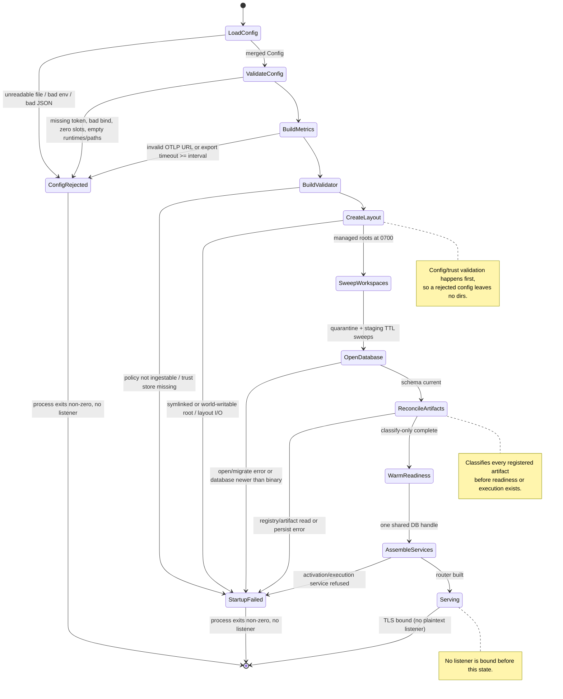
```mermaid
stateDiagram-v2
    [*] --> LoadConfig
    LoadConfig --> ConfigRejected: unreadable file / bad env / bad JSON
    LoadConfig --> ValidateConfig: merged Config
    ValidateConfig --> ConfigRejected: missing token, bad bind, zero slots, empty runtimes/paths
    ValidateConfig --> BuildMetrics
    BuildMetrics --> ConfigRejected: invalid OTLP URL or export timeout >= interval
    BuildMetrics --> BuildValidator
    BuildValidator --> StartupFailed: policy not ingestable / trust store missing
    BuildValidator --> CreateLayout
    CreateLayout --> StartupFailed: symlinked or world-writable root / layout I/O
    CreateLayout --> SweepWorkspaces: managed roots at 0700
    SweepWorkspaces --> OpenDatabase: quarantine + staging TTL sweeps
    OpenDatabase --> StartupFailed: open/migrate error or database newer than binary
    OpenDatabase --> ReconcileArtifacts: schema current
    ReconcileArtifacts --> StartupFailed: registry/artifact read or persist error
    ReconcileArtifacts --> WarmReadiness: classify-only complete
    WarmReadiness --> AssembleServices: one shared DB handle
    AssembleServices --> StartupFailed: activation/execution service refused
    AssembleServices --> Serving: router built
    Serving --> [*]: TLS bound (no plaintext listener)
    ConfigRejected --> [*]: process exits non-zero, no listener
    StartupFailed --> [*]: process exits non-zero, no listener

    note right of CreateLayout
        Config/trust validation happens first,
        so a rejected config leaves no dirs.
    end note
    note right of ReconcileArtifacts
        Classifies every registered artifact
        before readiness or execution exists.
    end note
    note right of Serving
        No listener is bound before this state.
    end note
```

## 2. HTTP request guards (`api`)

Source: `src/api/routes.rs`, `src/api/uploads.rs`, `src/api/errors.rs`.

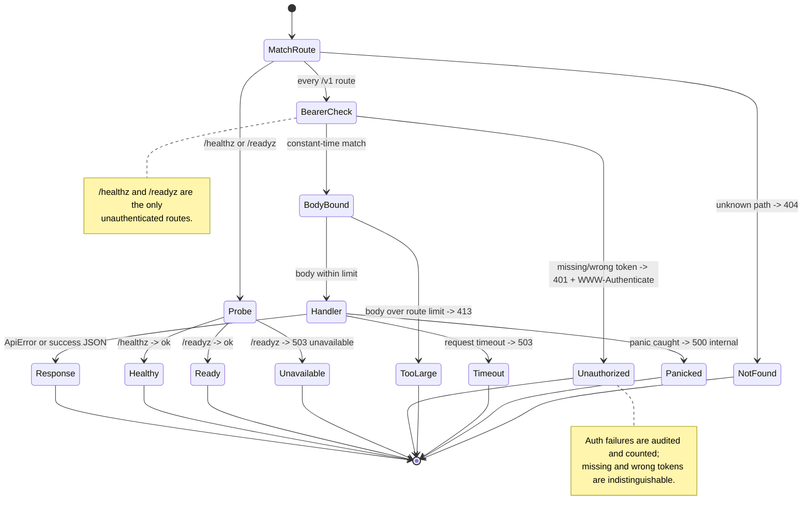
```mermaid
stateDiagram-v2
    [*] --> MatchRoute
    MatchRoute --> NotFound: unknown path -> 404
    MatchRoute --> Probe: /healthz or /readyz
    Probe --> Healthy: /healthz -> ok
    Probe --> Ready: /readyz -> ok
    Probe --> Unavailable: /readyz -> 503 unavailable
    MatchRoute --> BearerCheck: every /v1 route
    BearerCheck --> Unauthorized: missing/wrong token -> 401 + WWW-Authenticate
    BearerCheck --> BodyBound: constant-time match
    BodyBound --> TooLarge: body over route limit -> 413
    BodyBound --> Handler: body within limit
    Handler --> Response: ApiError or success JSON
    Handler --> Timeout: request timeout -> 503
    Handler --> Panicked: panic caught -> 500 internal
    Response --> [*]
    Healthy --> [*]
    Ready --> [*]
    Unavailable --> [*]
    Unauthorized --> [*]
    TooLarge --> [*]
    Timeout --> [*]
    Panicked --> [*]
    NotFound --> [*]

    note right of BearerCheck
        /healthz and /readyz are the only
        unauthenticated routes.
    end note
    note right of Unauthorized
        Auth failures are audited and counted;
        missing and wrong tokens are indistinguishable.
    end note
```

## 3. Upload pipeline (`control_plane` + `storage` + `modules`)

Source: `src/api/uploads.rs`, `src/control_plane/*`,
`src/storage/{quarantine,artifact_store}.rs`, `src/modules/registry.rs`.

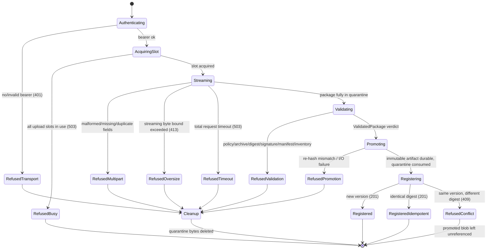
```mermaid
stateDiagram-v2
    [*] --> Authenticating
    Authenticating --> RefusedTransport: no/invalid bearer (401)
    Authenticating --> AcquiringSlot: bearer ok
    AcquiringSlot --> RefusedBusy: all upload slots in use (503)
    AcquiringSlot --> Streaming: slot acquired
    Streaming --> RefusedMultipart: malformed/missing/duplicate fields
    Streaming --> RefusedOversize: streaming byte bound exceeded (413)
    Streaming --> RefusedTimeout: total request timeout (503)
    Streaming --> Validating: package fully in quarantine
    Validating --> RefusedValidation: policy/archive/digest/signature/manifest/inventory
    Validating --> Promoting: ValidatedPackage verdict
    Promoting --> RefusedPromotion: re-hash mismatch / I/O failure
    Promoting --> Registering: immutable artifact durable, quarantine consumed
    Registering --> Registered: new version (201)
    Registering --> RegisteredIdempotent: identical digest (201)
    Registering --> RefusedConflict: same version, different digest (409)
    RefusedTransport --> Cleanup
    RefusedBusy --> [*]
    RefusedMultipart --> Cleanup
    RefusedOversize --> Cleanup
    RefusedTimeout --> Cleanup
    RefusedValidation --> Cleanup
    RefusedPromotion --> Cleanup
    RefusedConflict --> [*]: promoted blob left unreferenced
    Cleanup --> [*]: quarantine bytes deleted
    Registered --> [*]
    RegisteredIdempotent --> [*]
```

## 4. Package validation stages (`control_plane::validate_package`)

Source: `src/control_plane/validate_package.rs`.

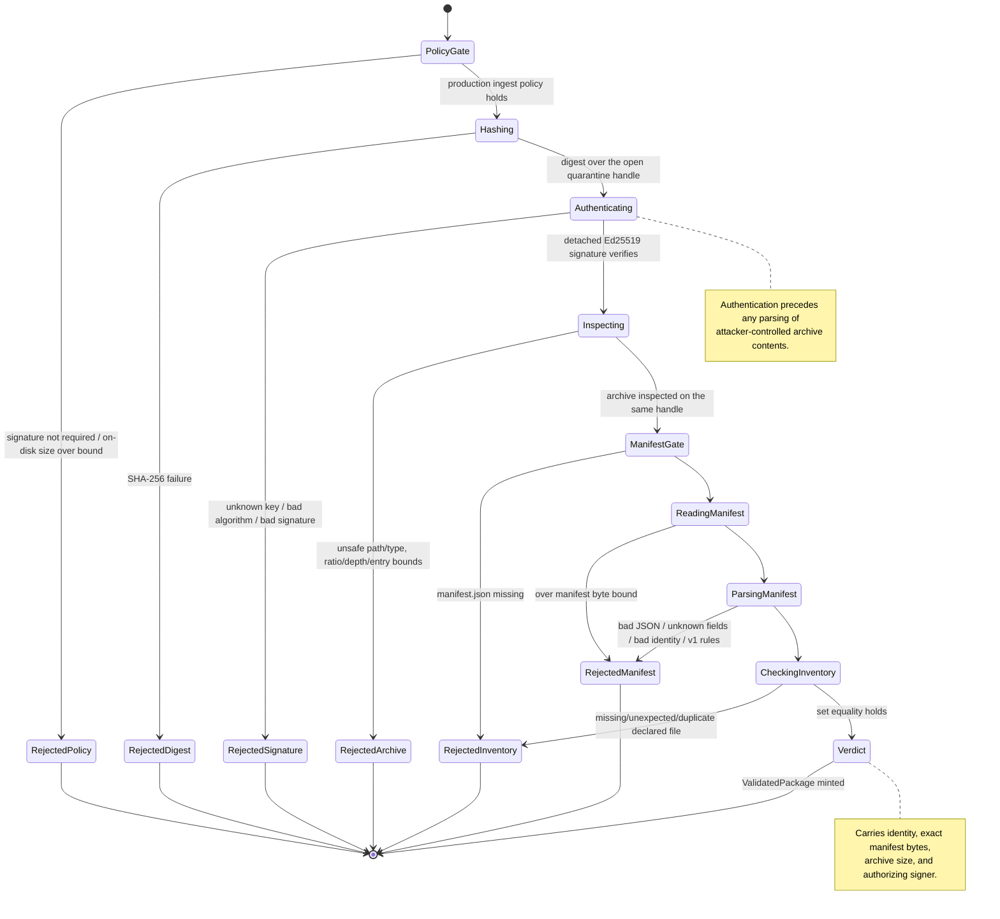
```mermaid
stateDiagram-v2
    [*] --> PolicyGate
    PolicyGate --> RejectedPolicy: signature not required / on-disk size over bound
    PolicyGate --> Hashing: production ingest policy holds
    Hashing --> RejectedDigest: SHA-256 failure
    Hashing --> Authenticating: digest over the open quarantine handle
    Authenticating --> RejectedSignature: unknown key / bad algorithm / bad signature
    Authenticating --> Inspecting: detached Ed25519 signature verifies
    Inspecting --> RejectedArchive: unsafe path/type, ratio/depth/entry bounds
    Inspecting --> ManifestGate: archive inspected on the same handle
    ManifestGate --> RejectedInventory: manifest.json missing
    ManifestGate --> ReadingManifest
    ReadingManifest --> RejectedManifest: over manifest byte bound
    ReadingManifest --> ParsingManifest
    ParsingManifest --> RejectedManifest: bad JSON / unknown fields / bad identity / v1 rules
    ParsingManifest --> CheckingInventory
    CheckingInventory --> RejectedInventory: missing/unexpected/duplicate declared file
    CheckingInventory --> Verdict: set equality holds
    Verdict --> [*]: ValidatedPackage minted

    RejectedPolicy --> [*]
    RejectedDigest --> [*]
    RejectedSignature --> [*]
    RejectedArchive --> [*]
    RejectedManifest --> [*]
    RejectedInventory --> [*]

    note right of Authenticating
        Authentication precedes any parsing of
        attacker-controlled archive contents.
    end note
    note right of Verdict
        Carries identity, exact manifest bytes,
        archive size, and authorizing signer.
    end note
```

## 5. Module lifecycle (`modules`)

### 5.1 Current behavior

Source: `src/modules/registry.rs`, `src/modules/activation.rs`,
`src/control_plane/activate_module.rs`, `src/control_plane/execute_module.rs`,
`src/control_plane/lifecycle.rs`.

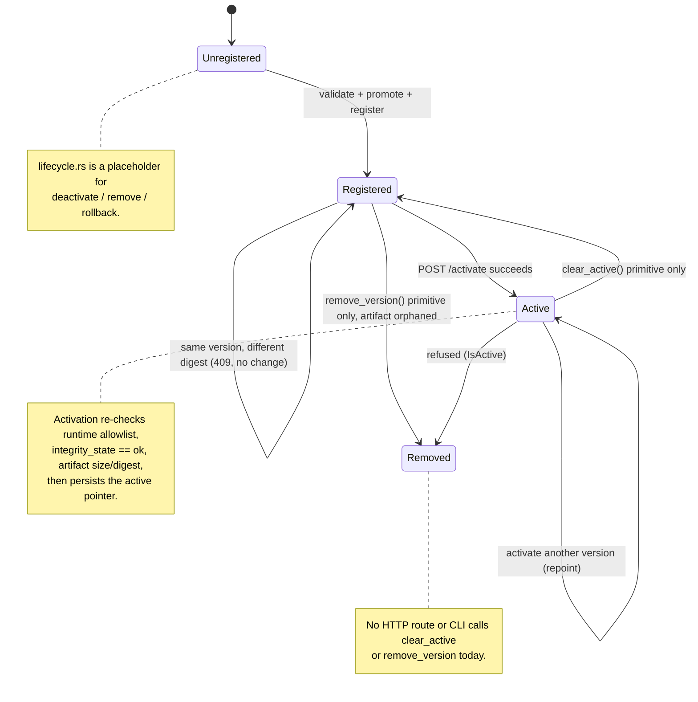
```mermaid
stateDiagram-v2
    [*] --> Unregistered
    Unregistered --> Registered: validate + promote + register
    Registered --> Registered: re-upload identical digest (idempotent)
    Registered --> Registered: same version, different digest (409, no change)
    Registered --> Active: POST /activate succeeds
    Active --> Active: activate another version (repoint)
    Active --> Registered: clear_active() primitive only
    Registered --> Removed: remove_version() primitive only, artifact orphaned
    Active --> Removed: refused (IsActive)

    note right of Active
        Activation re-checks runtime allowlist,
        integrity_state == ok, artifact size/digest,
        then persists the active pointer.
    end note
    note right of Removed
        No HTTP route or CLI calls clear_active
        or remove_version today.
    end note
    note right of Unregistered
        lifecycle.rs is a placeholder for
        deactivate / remove / rollback.
    end note
```

### 5.2 Target lifecycle (**planned**)

Source: [architecture.md](architecture.md#not-built-yet),
`src/control_plane/lifecycle.rs`.

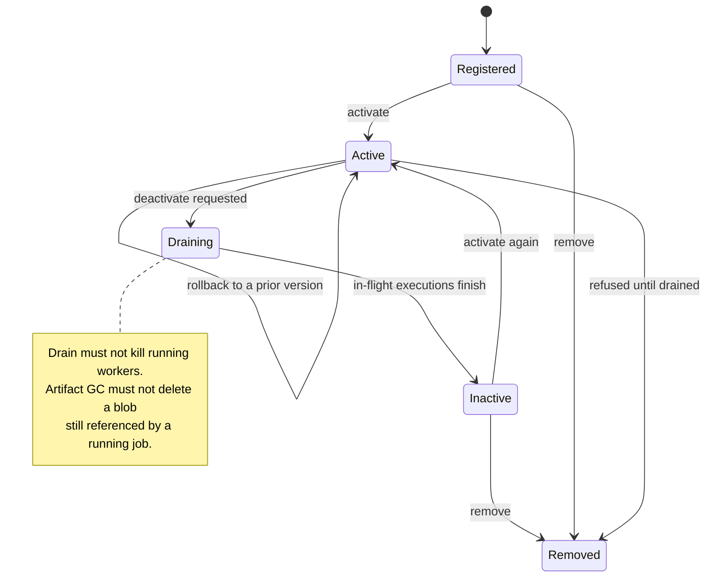
```mermaid
stateDiagram-v2
    [*] --> Registered
    Registered --> Active: activate
    Active --> Active: rollback to a prior version
    Active --> Draining: deactivate requested
    Draining --> Inactive: in-flight executions finish
    Inactive --> Active: activate again
    Inactive --> Removed: remove
    Registered --> Removed: remove
    Active --> Removed: refused until drained

    note right of Draining
        Drain must not kill running workers.
        Artifact GC must not delete a blob
        still referenced by a running job.
    end note
```

## 6. Registered-artifact execution (`control_plane::execute_module`)

Source: `src/control_plane/execute_module.rs`, `src/api/executions.rs`.

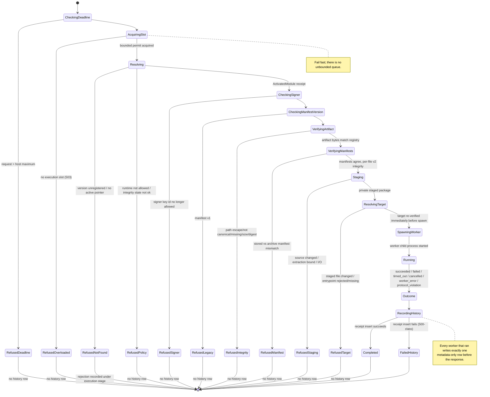
```mermaid
stateDiagram-v2
    [*] --> CheckingDeadline
    CheckingDeadline --> RefusedDeadline: request > host maximum
    CheckingDeadline --> AcquiringSlot
    AcquiringSlot --> RefusedOverloaded: no execution slot (503)
    AcquiringSlot --> Resolving: bounded permit acquired
    Resolving --> RefusedNotFound: version unregistered / no active pointer
    Resolving --> RefusedPolicy: runtime not allowed / integrity state not ok
    Resolving --> CheckingSigner: ActivatedModule receipt
    CheckingSigner --> RefusedSigner: signer key id no longer allowed
    CheckingSigner --> CheckingManifestVersion
    CheckingManifestVersion --> RefusedLegacy: manifest v1
    CheckingManifestVersion --> VerifyingArtifact
    VerifyingArtifact --> RefusedIntegrity: path escape/not canonical/missing/size/digest
    VerifyingArtifact --> VerifyingManifests: artifact bytes match registry
    VerifyingManifests --> RefusedManifest: stored vs archive manifest mismatch
    VerifyingManifests --> Staging: manifests agree, per-file v2 integrity
    Staging --> RefusedStaging: source changed / extraction bound / I/O
    Staging --> ResolvingTarget: private staged package
    ResolvingTarget --> RefusedTarget: staged file changed / entrypoint rejected/missing
    ResolvingTarget --> SpawningWorker: target re-verified immediately before spawn
    SpawningWorker --> Running: worker child process started
    Running --> Outcome: succeeded / failed / timed_out / cancelled / worker_error / protocol_violation
    Outcome --> RecordingHistory
    RecordingHistory --> Completed: receipt insert succeeds
    RecordingHistory --> FailedHistory: receipt insert fails (500-class)
    Completed --> [*]
    FailedHistory --> [*]

    RefusedDeadline --> [*]: no history row
    RefusedOverloaded --> [*]: no history row
    RefusedNotFound --> [*]: rejection recorded under execution stage
    RefusedPolicy --> [*]: no history row
    RefusedSigner --> [*]: no history row
    RefusedLegacy --> [*]: no history row
    RefusedIntegrity --> [*]: no history row
    RefusedManifest --> [*]: no history row
    RefusedStaging --> [*]: no history row
    RefusedTarget --> [*]: no history row

    note right of AcquiringSlot
        Fail fast; there is no unbounded queue.
    end note
    note right of RecordingHistory
        Every worker that ran writes exactly one
        metadata-only row before the response.
    end note
```

## 7. Worker process (`executions::executor`)

Source: `src/executions/executor.rs`, `src/executions/protocol.rs`.

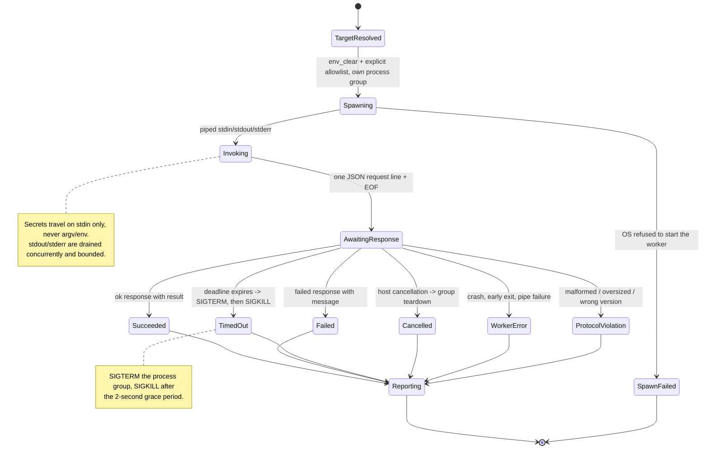
```mermaid
stateDiagram-v2
    [*] --> TargetResolved
    TargetResolved --> Spawning: env_clear + explicit allowlist, own process group
    Spawning --> SpawnFailed: OS refused to start the worker
    Spawning --> Invoking: piped stdin/stdout/stderr
    Invoking --> AwaitingResponse: one JSON request line + EOF
    AwaitingResponse --> Succeeded: ok response with result
    AwaitingResponse --> Failed: failed response with message
    AwaitingResponse --> TimedOut: deadline expires -> SIGTERM, then SIGKILL
    AwaitingResponse --> Cancelled: host cancellation -> group teardown
    AwaitingResponse --> WorkerError: crash, early exit, pipe failure
    AwaitingResponse --> ProtocolViolation: malformed / oversized / wrong version
    Succeeded --> Reporting
    Failed --> Reporting
    TimedOut --> Reporting
    Cancelled --> Reporting
    WorkerError --> Reporting
    ProtocolViolation --> Reporting
    Reporting --> [*]
    SpawnFailed --> [*]

    note right of Invoking
        Secrets travel on stdin only, never argv/env.
        stdout/stderr are drained concurrently and bounded.
    end note
    note right of TimedOut
        SIGTERM the process group, SIGKILL after
        the 2-second grace period.
    end note
```

## 8. Storage lifecycles (`storage`)

Source: `src/storage/quarantine.rs`, `src/storage/artifact_store.rs`,
`src/storage/staging.rs`, `src/server.rs`.

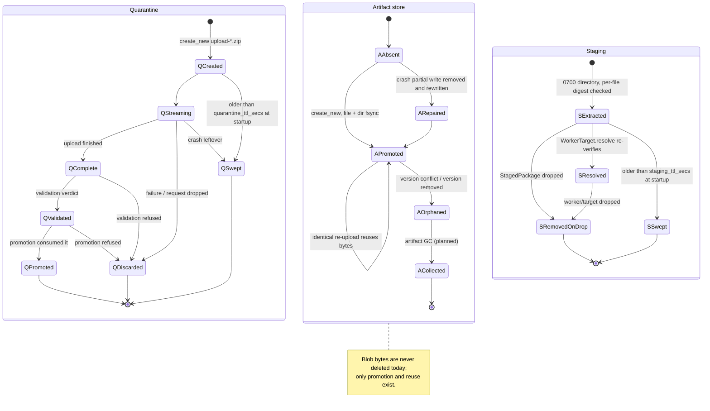
```mermaid
stateDiagram-v2
    state "Quarantine" as Quarantine {
        [*] --> QCreated: create_new upload-*.zip
        QCreated --> QStreaming
        QStreaming --> QComplete: upload finished
        QStreaming --> QDiscarded: failure / request dropped
        QComplete --> QValidated: validation verdict
        QComplete --> QDiscarded: validation refused
        QValidated --> QPromoted: promotion consumed it
        QValidated --> QDiscarded: promotion refused
        QCreated --> QSwept: older than quarantine_ttl_secs at startup
        QStreaming --> QSwept: crash leftover
        QDiscarded --> [*]
        QPromoted --> [*]
        QSwept --> [*]
    }

    state "Artifact store" as Artifacts {
        [*] --> AAbsent
        AAbsent --> APromoted: create_new, file + dir fsync
        APromoted --> APromoted: identical re-upload reuses bytes
        APromoted --> AOrphaned: version conflict / version removed
        AAbsent --> ARepaired: crash partial write removed and rewritten
        ARepaired --> APromoted
        AOrphaned --> ACollected: artifact GC (planned)
        ACollected --> [*]
    }

    state "Staging" as Staging {
        [*] --> SExtracted: 0700 directory, per-file digest checked
        SExtracted --> SResolved: WorkerTarget.resolve re-verifies
        SExtracted --> SRemovedOnDrop: StagedPackage dropped
        SResolved --> SRemovedOnDrop: worker/target dropped
        SExtracted --> SSwept: older than staging_ttl_secs at startup
        SRemovedOnDrop --> [*]
        SSwept --> [*]
    }

    note right of Artifacts
        Blob bytes are never deleted today;
        only promotion and reuse exist.
    end note
```

## 9. Readiness (`readiness`)

Source: `src/readiness.rs`, `src/server.rs`.

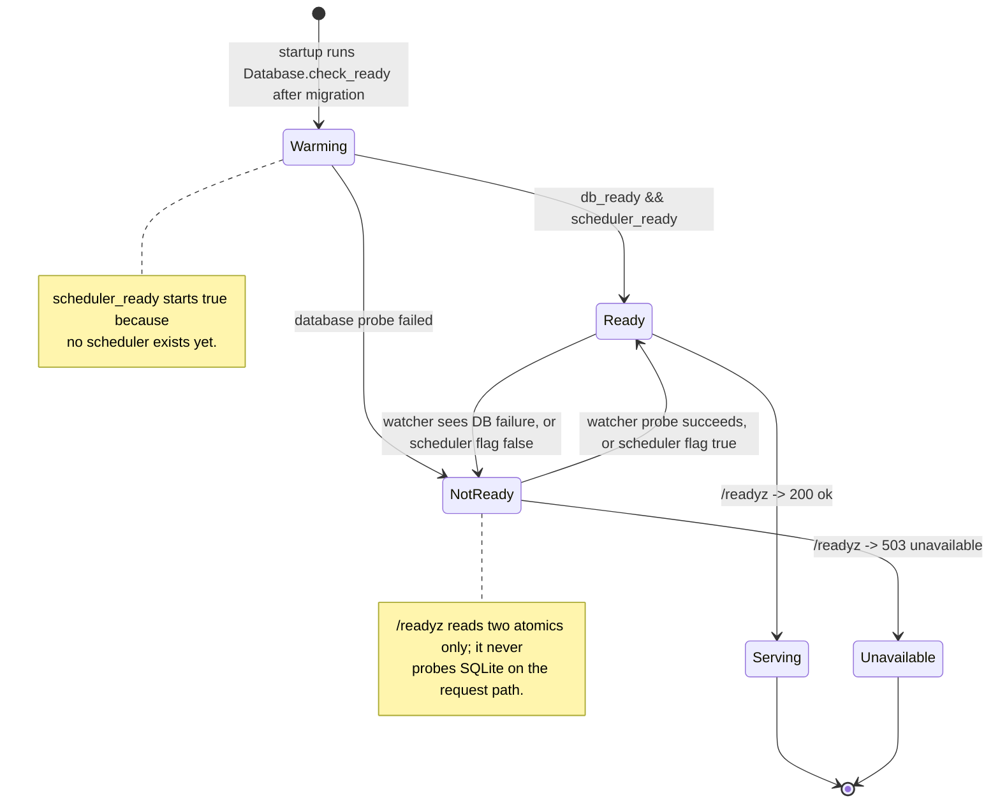
```mermaid
stateDiagram-v2
    [*] --> Warming: startup runs Database.check_ready after migration
    Warming --> Ready: db_ready && scheduler_ready
    Warming --> NotReady: database probe failed
    Ready --> NotReady: watcher sees DB failure, or scheduler flag false
    NotReady --> Ready: watcher probe succeeds, or scheduler flag true
    Ready --> Serving: /readyz -> 200 ok
    NotReady --> Unavailable: /readyz -> 503 unavailable
    Serving --> [*]
    Unavailable --> [*]

    note right of Warming
        scheduler_ready starts true because
        no scheduler exists yet.
    end note
    note right of NotReady
        /readyz reads two atomics only; it never
        probes SQLite on the request path.
    end note
```

## 10. Artifact integrity / reconciliation (`modules::registry`)

### 10.1 Current behavior

Source: `src/modules/registry.rs` (`IntegrityState`),
`src/control_plane/reconcile.rs`, `src/storage/artifact_verify.rs`.

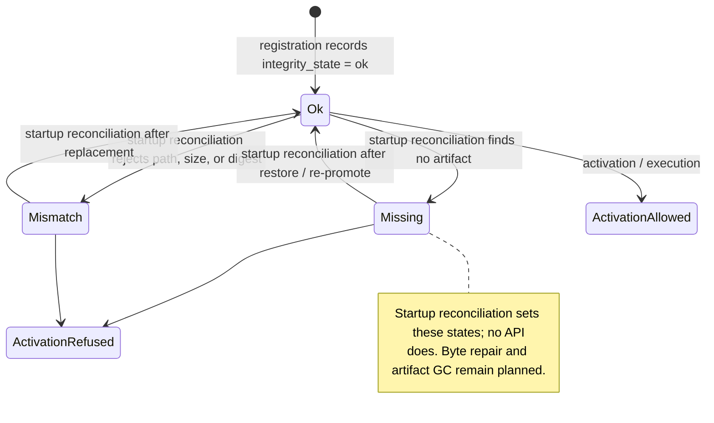
```mermaid
stateDiagram-v2
    [*] --> Ok: registration records integrity_state = ok
    Ok --> Missing: startup reconciliation finds no artifact
    Ok --> Mismatch: startup reconciliation rejects path, size, or digest
    Missing --> Ok: startup reconciliation after restore / re-promote
    Mismatch --> Ok: startup reconciliation after replacement
    Ok --> ActivationAllowed: activation / execution
    Missing --> ActivationRefused
    Mismatch --> ActivationRefused

    note right of Missing
        Startup reconciliation sets these states; no API
        does. Byte repair and artifact GC remain planned.
    end note
```

### 10.2 Startup reconciliation (**classify-only implemented; repair/orphan/runs planned**)

Source: `src/control_plane/reconcile.rs`,
`src/storage/artifact_verify.rs`,
[design-persistence.md](design-persistence.md) PR4,
[storage-reconciliation.md](storage-reconciliation.md) items 8 and 11.
`Host::assemble` runs classification after building the registry and before
readiness, execution services, or the router.

Implemented classify-only flow:

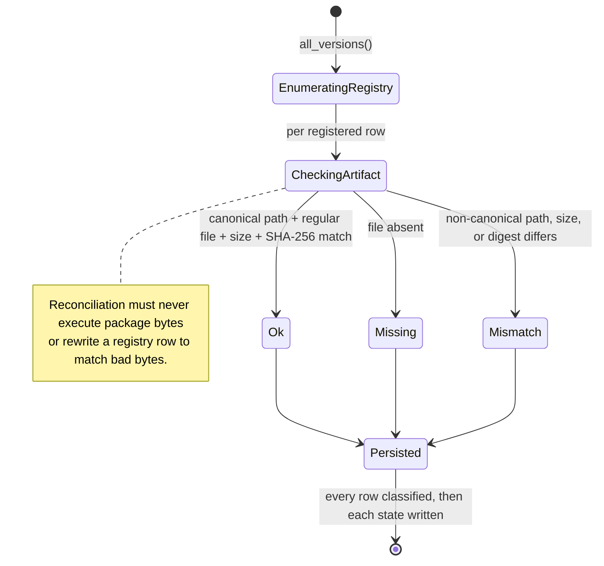
```mermaid
stateDiagram-v2
    [*] --> EnumeratingRegistry: all_versions()
    EnumeratingRegistry --> CheckingArtifact: per registered row
    CheckingArtifact --> Ok: canonical path + regular file + size + SHA-256 match
    CheckingArtifact --> Missing: file absent
    CheckingArtifact --> Mismatch: non-canonical path, size, or digest differs
    Ok --> Persisted
    Missing --> Persisted
    Mismatch --> Persisted
    Persisted --> [*]: every row classified, then each state written

    note right of CheckingArtifact
        Reconciliation must never execute package bytes
        or rewrite a registry row to match bad bytes.
    end note
```

Deferred: repair after restore or replacement (`Missing --> Ok`,
`Mismatch --> Ok`), orphan scanning, artifact GC, and one
`reconciliation_runs` row per pass.

## 11. Scheduler / triggering (**manual and interval implemented; cron/retry planned**)

Source: `src/control_plane/scheduler/`, `src/readiness.rs`,
`src/metrics.rs` (`conductor.job.wait.duration`, queue/active gauges).

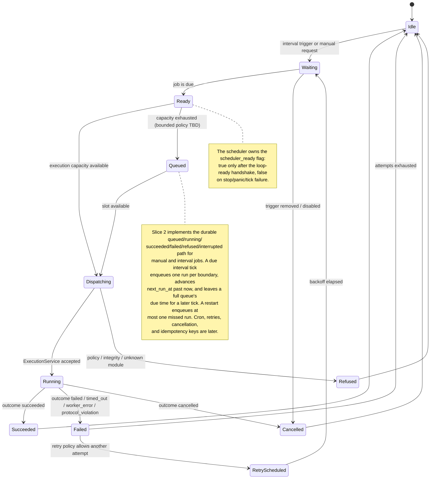
```mermaid
stateDiagram-v2
    [*] --> Idle
    Idle --> Waiting: interval trigger or manual request
    Waiting --> Ready: job is due
    Waiting --> Cancelled: trigger removed / disabled
    Ready --> Dispatching: execution capacity available
    Ready --> Queued: capacity exhausted (bounded policy TBD)
    Queued --> Dispatching: slot available
    Dispatching --> Running: ExecutionService accepted
    Dispatching --> Refused: policy / integrity / unknown module
    Running --> Succeeded: outcome succeeded
    Running --> Failed: outcome failed / timed_out / worker_error / protocol_violation
    Running --> Cancelled: outcome cancelled
    Failed --> RetryScheduled: retry policy allows another attempt
    RetryScheduled --> Waiting: backoff elapsed
    Succeeded --> Idle
    Failed --> Idle: attempts exhausted
    Cancelled --> Idle
    Refused --> Idle

    note right of Queued
        Slice 2 implements the durable queued/running/
        succeeded/failed/refused/interrupted path for
        manual and interval jobs. A due interval tick
        enqueues one run per boundary, advances
        next_run_at past now, and leaves a full queue's
        due time for a later tick. A restart enqueues at
        most one missed run. Cron, retries, cancellation,
        and idempotency keys are later.
    end note
    note right of Ready
        The scheduler owns the scheduler_ready flag:
        true only after the loop-ready handshake, false
        on stop/panic/tick failure.
    end note
```

## 12. Rejection audit (`audit`)

Source: `src/audit/event.rs`, `src/audit/recorder.rs`,
`src/api/uploads.rs`, `src/api/executions.rs`.

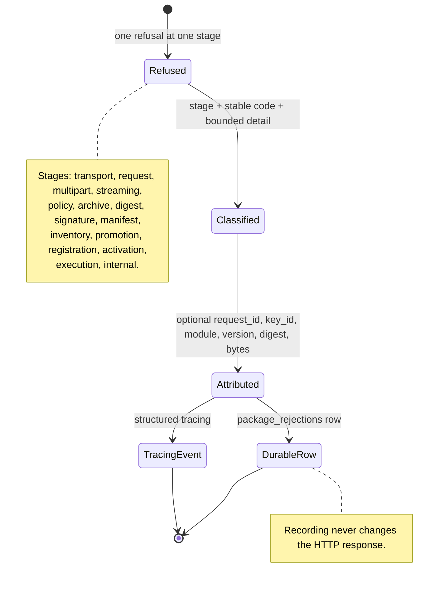
```mermaid
stateDiagram-v2
    [*] --> Refused: one refusal at one stage
    Refused --> Classified: stage + stable code + bounded detail
    Classified --> Attributed: optional request_id, key_id, module, version, digest, bytes
    Attributed --> TracingEvent: structured tracing
    Attributed --> DurableRow: package_rejections row
    TracingEvent --> [*]
    DurableRow --> [*]

    note right of Refused
        Stages: transport, request, multipart, streaming,
        policy, archive, digest, signature, manifest,
        inventory, promotion, registration, activation,
        execution, internal.
    end note
    note right of DurableRow
        Recording never changes the HTTP response.
    end note
```

## Remaining work

Derived from [architecture.md § Not built yet](architecture.md#not-built-yet),
[design-persistence.md](design-persistence.md), and
[storage-reconciliation.md](storage-reconciliation.md). There is no ordering
guarantee beyond the dependencies noted.

| Priority | Work item | Current evidence | Blocks |
| --- | --- | --- | --- |
| 1 | **Scheduler / triggering**: durable job definitions, cron/interval triggers, queueing, dispatch, retry/attempt semantics, cancellation, scheduler readiness hook, job-wait histogram | Slice 2 implements durable manual and interval jobs, interval due enqueue, queue/dispatch, recovery, readiness, and job wait/queue/active metrics. Cron triggers, retries, cancellation, and multi-process ownership remain | Produces the jobs the platform exists to run |
| 2 | **Operator CLI**: upload, validate, activate, execute, history, lifecycle, reconcile commands | `tests/cli.rs` only drives startup failures; no CLI module | Operator usability; today everything is raw HTTP |
| 3 | **Module lifecycle transitions**: deactivate, remove, rollback, drain running work, reference counting | `src/control_plane/lifecycle.rs` is a placeholder; `clear_active` / `remove_version` are registry primitives with no caller | Artifact GC and safe upgrades |
| 4 | **Startup reconciliation**: scan registry vs artifact store, populate `Missing`/`Mismatch`, repair or quarantine, record `reconciliation_runs` | Classifier and startup wiring implemented in `Host::assemble`; repair, orphan detection, and `reconciliation_runs` deferred; design says PR4 | Trustworthy restart state |
| 5 | **Artifact GC**: delete orphaned blobs left by version conflicts or removals, with reference checks against active versions and in-flight jobs | `remove_version` deliberately leaves bytes orphaned; no GC | Unbounded disk growth |
| 6 | **Execution-history retention/GC**: age or count policy for the `executions` table | README and architecture both state growth is unbounded | Unbounded DB growth |
| 7 | **Trust-key lifecycle and per-module authorization**: rotation/revocation beyond restart-time config, key→module scope | `TrustedSigningKey` has no scope; execution checks only key id, not signature | Least-privilege signing |
| 8 | **Operational hardening**: disk-pressure preflight with a defined rejection code; explicit artifact file modes | No free-space preflight; artifact files rely on umask | Predictable failure under pressure |
| 9 | **Observability**: tracing/exemplars, durable audit beyond rejection rows, optional log files, alerting | Metrics are OTLP-only; no `/metrics`; no tracing exporter or exemplars | Incident diagnosis |
| 10 | **Decide staging-execution invariant and dedup layout** before more artifacts accumulate | Executor runs from re-verified staging; artifacts are not deduplicated across module versions | Storage/GC design and migration cost |

### Notes on in-progress work

- Metrics and readiness landed in Slice 0 and are committed. The charts above
  describe the current tree, including readiness, metrics, and classify-only
  startup reconciliation.
- `tests/cli.rs` is the process-level startup suite, not an operator CLI
  suite; do not mistake it for implemented CLI coverage.
